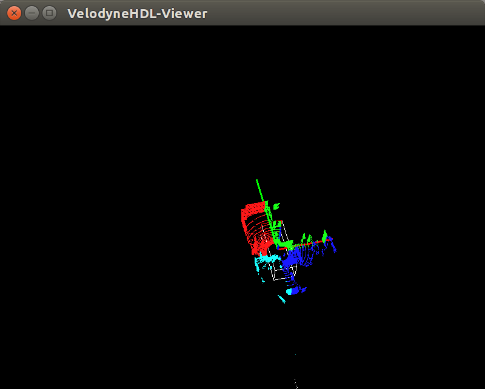
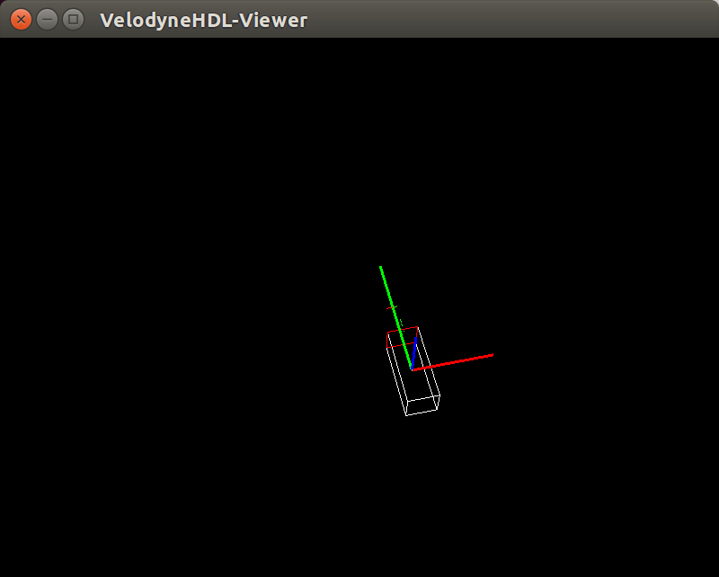

Velodyne_viewer
===============

​	**Velodyne_viewer** is a project for 3D LiDAR ([Velodyne](http://velodynelidar.com/) 16, 32 and 64 channels) point cloud visualization, LiDAR-based obstacle detection and position estimation.

<center></center>

<center> </center>

### How to use?

```shell
$ git clone https://github.com/CPSinSYSU/SHCD2017.git Velodyne_viewer -b cmake && cd Velodyne_viewer
$ source setup.sh

# Setup at first time, next
# cd bin
# configure network to the same subnet, using UI or following
$ ./set_ip.sh
# avoid firewall probem
$ ./set_iptables.sh
# start viewer(both real-time mode or replay mode)
$ ./run_viewer.sh

# pcap data replay for simulation(in another terminal/tag)
$ cd pcap
# choose-file-name.pcap should locate in pcap folder
$ ./pcap_replay.sh choose-file-name.pcap
# for 32-bit pcap file, use pcap_replay32.py instead
$ ./pcap_replay32.sh choose-file-name.pcap
```
